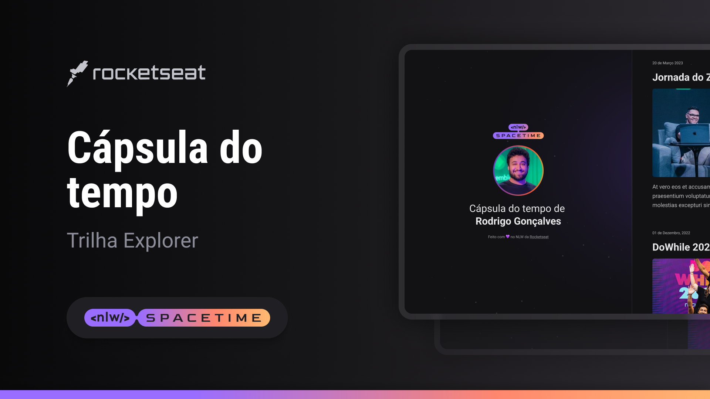

  

## 🖥️ Projeto

O projeto é uma cápsula do tempo para exibir memórias eem uma linha do tempo.

## 🚀 Tecnologia

Esse projeto foi desennvolvido com as seguintes tecnologias:

- HTML
- CSS
- GIT e GITHUB

## 🏷️ Layout

Você pode visuzalizar o layout do projeto através 
[Desse link](https://www.figma.com/file/NktrJy7Iif3RFmsxKdEK0o/C%C3%A1psula-do-tempo?type=design&node-id=306%3A3&t=kas07ZXoXf3ZsaM2-1).
É necessário ter uma conta no [Figma](https://www.figma.com)